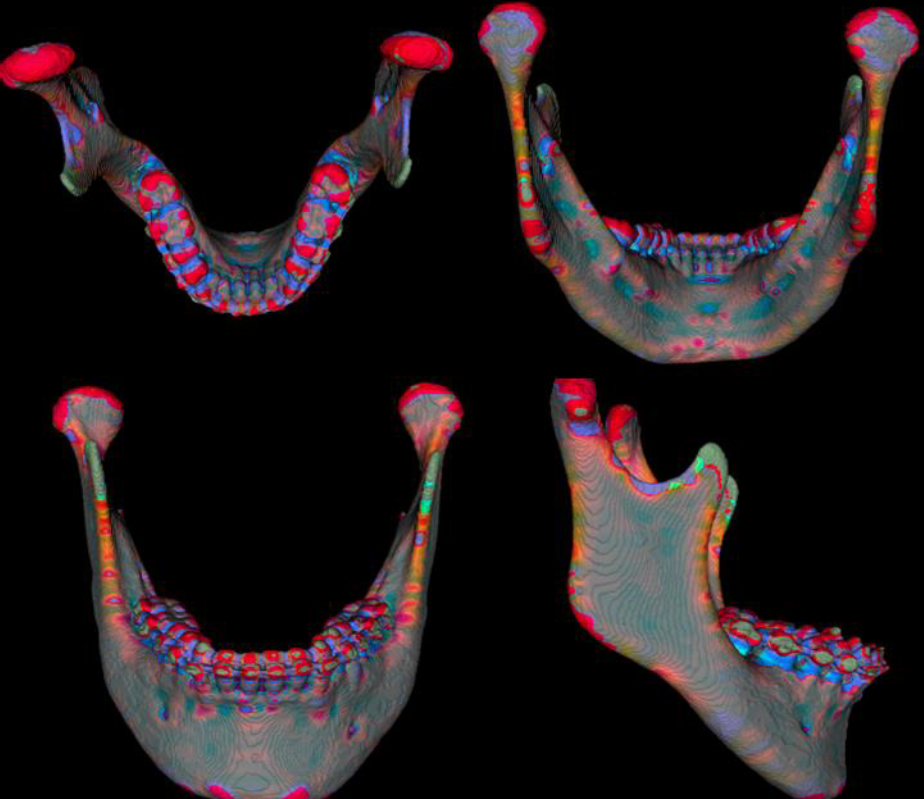

# Rendering test
昨年、中退した東京医科歯科大学での研究の一環としてレンダリングを行っていた
# supplement
・slackapiによるボタン作成とそのアクションによるlambdaの起動

・lambdaの機能拡大によりapigatewayは不要になるだろう

input,outputはファイルが大きすぎるためあげていない

# result
顎顔面の曲率を表すレンダリングを作成した

